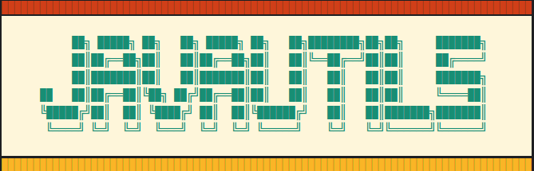

# javaUtils - Bibliothèque Java pour les structures de données
javaUtils est une bibliothèque Java qui propose des structures de données et des utilitaires pour faciliter le développement d'applications. Elle offre des fonctionnalités de base pour manipuler des structures de données courantes de manière générique et flexible.

## Structures de données disponibles

- **ListAbstract** - Class abstraite qui sert de base pour les structures de données.
- **List** - Structure de données doublement chaînée
La classe List est une implémentation d'une structure de données doublement chaînée en Java. Elle offre des fonctionnalités telles que l'insertion, la suppression, l'accès aux éléments et bien d'autres. Elle permet de gérer une collection d'objets de manière efficace et offre une grande flexibilité dans la manipulation des données.

- **ListCloneable** - Liste avec éléments clonables
La classe ListCloneable est une extension de la classe List qui prend en charge les éléments clonables. Elle permet de créer une liste contenant des objets clonables et fournit des méthodes pour cloner les éléments lors de l'ajout, la modification ou la récupération.

- **Filtre** - Interface de filtrage
L'interface Filtre est une interface fonctionnelle qui définit une méthode apply pour filtrer les éléments d'une structure de données. Elle peut être utilisée en conjonction avec les classes List et ListCloneable pour effectuer des recherches ou des filtrages spécifiques.
La classe `List` est une implémentation d'une structure de données doublement chaînée en Java. Elle offre des fonctionnalités de base telles que l'insertion, la suppression, l'accès aux éléments et bien d'autres.

*Ce projet a été réalisé dans le cadre de l'apprentissage des concepts avancés de la programmation orientée objet en Java. La classe List offre une manière flexible et générique de manipuler une structure de données doublement chaînée.*

## Fonctionnalités

- Insertion d'éléments au début de la liste (`push`)
- Insertion d'éléments à la fin de la liste (`append`)
- Insertion d'éléments à un index spécifié (`insert`)
- Accès à un élément à partir de son index (`get`)
- Modification d'un élément à un index spécifié (`set`)
- Suppression d'un élément à un index spécifié (`remove`)
- Recherche d'un élément satisfaisant un critère spécifié (`getFirst`)
- Vérification si la liste est vide (`isEmpty`)
- Effacement de tous les éléments de la liste (`clear`)
- retourne le premier élément qui satisfait le filtre passé en argument (`find`)
- retourne une nouvelle List de tous les éléments filtrés (`findAll`)

## Utilisation

Pour tester la classe `List` et `ListCloneable`, vous pouvez télécharger le répertoire:

```bash
git clone https://github.com/saoudi-h/javaUtils.git
cd javaUtils
 
```

## Tests
Ce projet utilise JUnit pour les tests unitaires. Les tests sont situés dans le répertoire src/test/java. Vous pouvez exécuter les tests à l'aide de la commande suivante :

```bash
mvn test
```

## Javadoc
Ce projet a était docummenté en français. Vous pouvez génèrer la doc avec la commande suivante :

```bash
mvn javadoc:javadoc
```
Le plugin Maven Javadoc générera la documentation dans le dossier `target/site/apidocs/`
## Génération du fichier JAR exécutable

Ce projet est configuré avec le plugin Maven maven-jar-plugin pour générer un fichier JAR exécutable. Vous pouvez générer le JAR en exécutant la commande suivante :
```bash
mvn verify
```
Le fichier JAR exécutable sera généré dans le répertoire target, situé a la racine du projet.
```bash
cd target
java -jar javaUtils-1.0-SNAPSHOT.jar
```

## Licence

Ce mini projet est sous licence [MIT](https://opensource.org/licenses/MIT).

## Contributeurs


